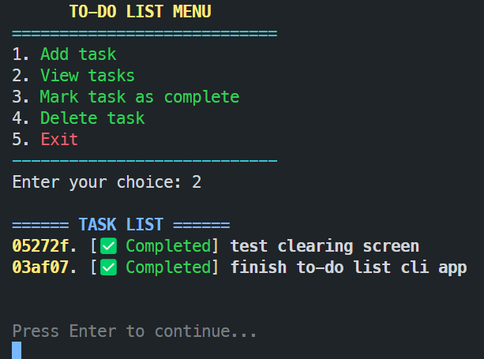

# 🚀 Day 10 - Learning Rust

## improved output

### startup cli


### view tasks



### Add task


### Mark task


### Exit


## output

```bash
To-do list Menu:
1. Add task
2. View Tasks
3. Mark task as complete
4. Delete task
5. Exit
Enter your choice: 2
No tasks found
To-do list Menu:
1. Add task
2. View Tasks
3. Mark task as complete
4. Delete task
5. Exit
Enter your choice: 1
Enter task description: cleaning house
task added
To-do list Menu:
1. Add task
2. View Tasks
3. Mark task as complete
4. Delete task
5. Exit
Enter your choice: 1
Enter task description: cooking
task added
To-do list Menu:
1. Add task
2. View Tasks
3. Mark task as complete
4. Delete task
5. Exit
Enter your choice: 1
Enter task description: soaking in the bathtub
task added
To-do list Menu:
1. Add task
2. View Tasks
3. Mark task as complete
4. Delete task
5. Exit
Enter your choice: 2
1 - not - cleaning house
2 - not - cooking
3 - not - soaking in the bathtub
To-do list Menu:
1. Add task
2. View Tasks
3. Mark task as complete
4. Delete task
5. Exit
Enter your choice: 3
Enter task ID to mark as complete: 1
task marked as complete
To-do list Menu:
1. Add task
2. View Tasks
3. Mark task as complete
4. Delete task
5. Exit
Enter your choice: 2
1 - ok - cleaning house
2 - not - cooking
3 - not - soaking in the bathtub
To-do list Menu:
1. Add task
2. View Tasks
3. Mark task as complete
4. Delete task
5. Exit
Enter your choice: 4
Enter task Id to delete1
task deleted
To-do list Menu:
1. Add task
2. View Tasks
3. Mark task as complete
4. Delete task
5. Exit
Enter your choice: 2
2 - not - cooking
3 - not - soaking in the bathtub
To-do list Menu:
1. Add task
2. View Tasks
3. Mark task as complete
4. Delete task
5. Exit
Enter your choice: 5
Tasks saved. Bye!!!!!
```
